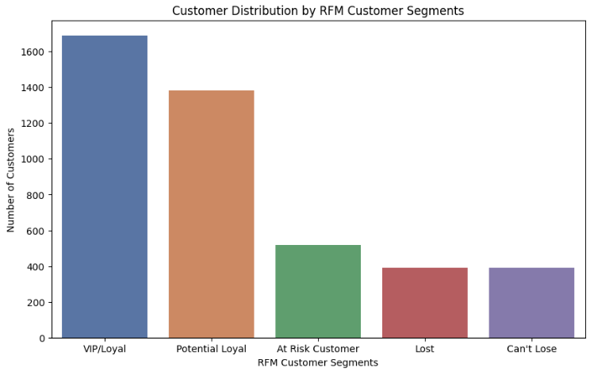
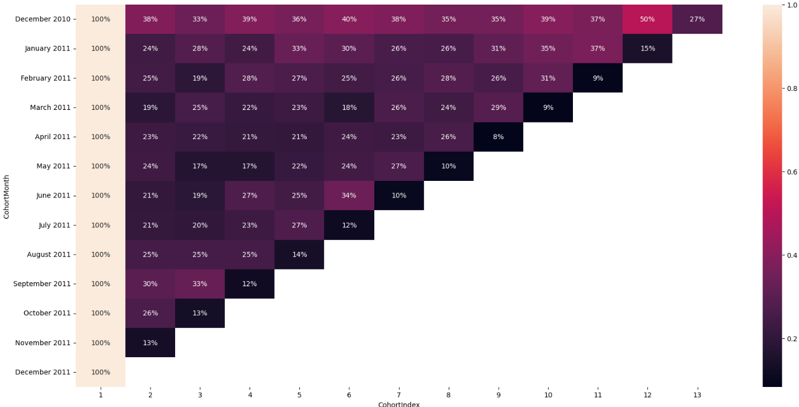
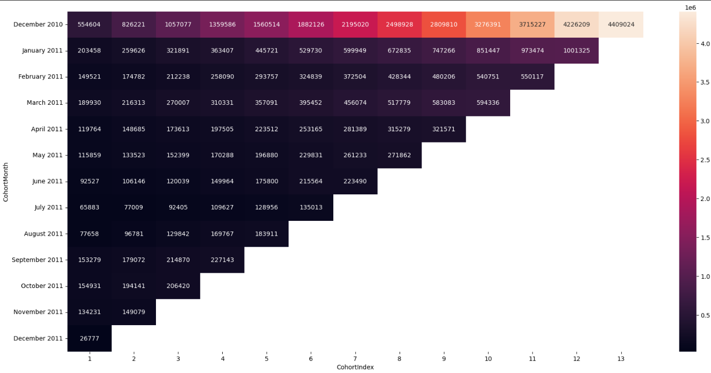
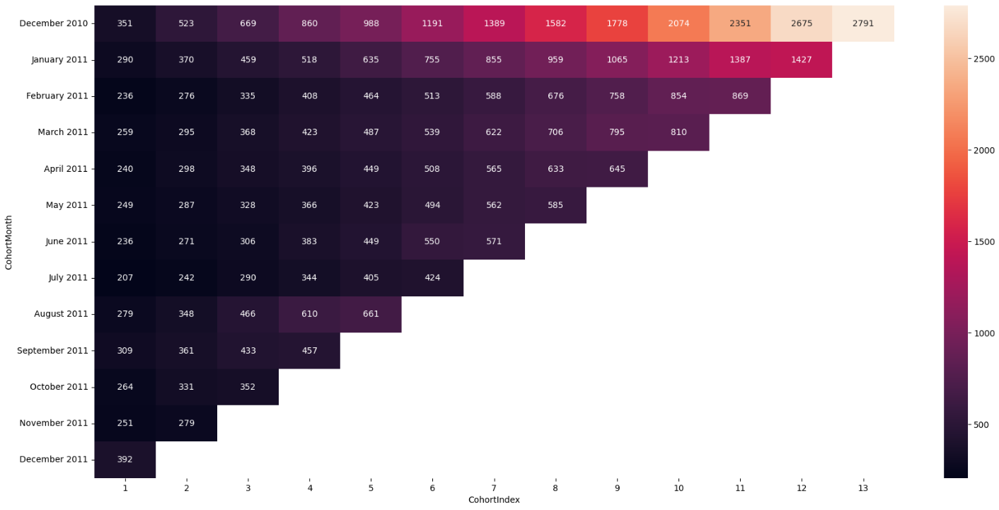
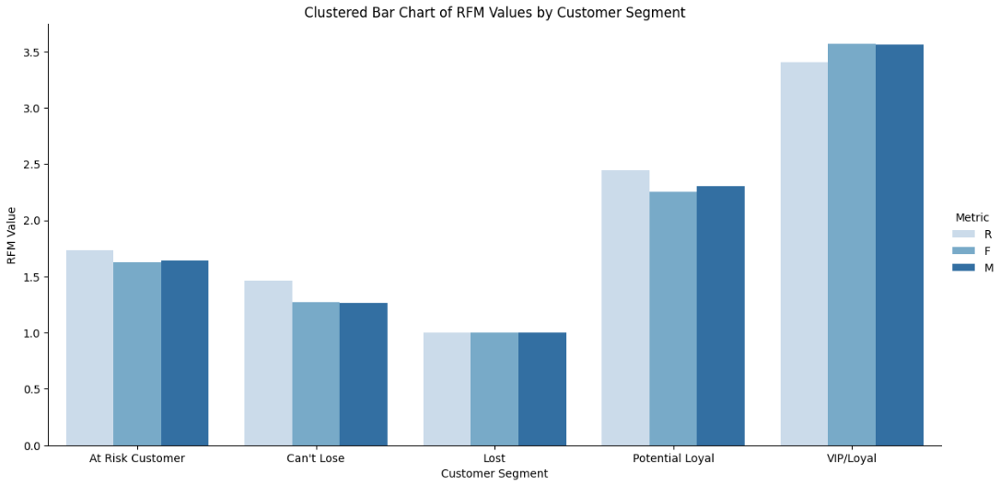

# *Customer Cohort and RFM Analysis on Retail Dataset*

## *Project Overview:*
In this project, I performed a Cohort Analysis, Net Dollar Revenue Analysis, Customer Lifetime Value Analysis, and RFM (Recency, Frequency, Monetary) Segmentation on an online retail dataset. The goal was to understand customer behavior over time, evaluate retention rates, assess customer lifetime revenue, and categorize customers based on their purchasing habits. Visualizations such as heatmaps, bar plots, and box plots were used to derive meaningful insights.

## *Notebook*
You can view the Jupyter Notebook for the analysis here: [Check the Notebook here](https://github.com/Ganapati-nk/Customer-Cohort-and-RFM-Analysis-on-Retail-Dataset/blob/main/Customer%20Cohort%20and%20RFM%20Analysis%20on%20Retail%20Dataset.ipynb)

## *Key Steps & Analysis Performed:*
### *1. Data Preprocessing:*
`Data Cleaning`: Handled missing data by dropping rows with missing CustomerID.

`Date Parsing`: Converted the InvoiceDate to a datetime object and created a new column InvoiceMonth representing the month of each transaction.

`Cohort Assignment`: Grouped customers by their first purchase month (CohortMonth) and calculated the cohort index to analyze customer behavior over time.
### *2. Cohort Analysis:*
`Cohort Grouping`: Identified cohorts based on the earliest purchase month for each customer.

`Retention Analysis`: Calculated the retention rate for each cohort by measuring how many customers from the original cohort continued making purchases in subsequent months.

`Visualization`: Created a cohort retention matrix and visualized it using heatmaps to understand the customer retention trends.

<a href="Cohort_Analysis_Image.png" target="_blank">
    

### *3. Net Dollar Revenue Analysis:*
`Revenue Calculation`: Calculated total revenue (TotalAmount = Quantity * UnitPrice) for each customer and cohort.

`Cumulative Revenue`: Performed cumulative revenue analysis to track how revenue accumulates over time for each cohort.

`Heatmap Visualization`: Visualized the revenue trends over time using heatmaps.

<a href="Cummulative_net_dollor.png" target="_blank">
    
    
### *4. Customer Lifetime Value Analysis:*
`Lifetime Revenue`: Divided cumulative revenue by the number of customers in each cohort to calculate customer lifetime revenue.

`Customer Lifetime Value (CLV)`: Assumed a gross profit margin of 60% and calculated the Customer Lifetime Value (CLV) by multiplying lifetime revenue by the gross margin.

<a href="Customer_Lifetime_value.png" target="_blank">
    

### *5. RFM Analysis:*
`Recency, Frequency, and Monetary (RFM`): Calculated RFM metrics for each customer. Recency refers to how recently a customer made a purchase, Frequency refers to how often they make purchases, and Monetary refers to the total amount spent.

`Quantile-based Scoring`: Used the RFM quantiles to score customers on each metric, assigning values from 1 to 4 for each.

`Customer Segmentation`: Segmented customers into groups such as "VIP/Loyal", "Potential Loyal", "At Risk", and "Lost" based on their RFM scores.

`Segmentation Insights`: Visualized customer distribution across different RFM segments and analyzed their purchasing behaviors.

<a href="RFM2.png" target="_blank">
    

## *Visualizations:*
`Cohort Heatmap`: Visualized customer retention rates across cohorts using a heatmap, highlighting how cohorts perform over time.

`Net Dollar Revenue Heatmap`: Displayed the total revenue for each cohort and month.

`Customer Lifetime Value Heatmap`: Showed the lifetime value per customer for each cohort, with gross profit applied.

`RFM Segmentation Visuals`: Used bar charts and boxplots to visualize customer distributions by RFM segments and metrics.

`Correlation Analysis`: Explored the correlation between RFM metrics, providing insights into customer behaviors.

## *Technologies and Tools Used:*
`Python` (Pandas, Numpy, Matplotlib, Seaborn)

`Excel` (Data import)

`Data Analysis`: Cohort analysis, RFM analysis, Customer lifetime value calculation

`Visualization`: Heatmaps, Bar plots, Boxplots

## *Insights and Business Value:*
`Customer Retention`: Identified which cohorts show the highest retention and which ones need more attention.

`Revenue Growth`: Analyzed which cohorts are generating the most revenue and tracked their growth over time.

`Customer Segmentation`: Identified high-value customers (VIP/Loyal) and at-risk customers, helping to target retention strategies more effectively.

`Customer Lifetime Value (CLV)`: Determined the estimated value of customers over their lifetime, allowing for better resource allocation and marketing strategies.

## *Skills Demonstrated:*
`Data Cleaning & Preprocessing`: Data wrangling and feature engineering to prepare the dataset for analysis.

`Cohort Analysis`: Ability to group data by cohorts and analyze retention trends over time.

`Revenue Analysis`: Conducting net revenue and cumulative revenue analysis.

`Customer Segmentation`: Performing RFM analysis and segmenting customers based on purchasing behavior.

`Data Visualization`: Visualizing complex data using heatmaps, bar plots, and boxplots to generate actionable insights.

`Statistical Analysis`: Understanding and calculating key business metrics such as Customer Lifetime Value (CLV).
